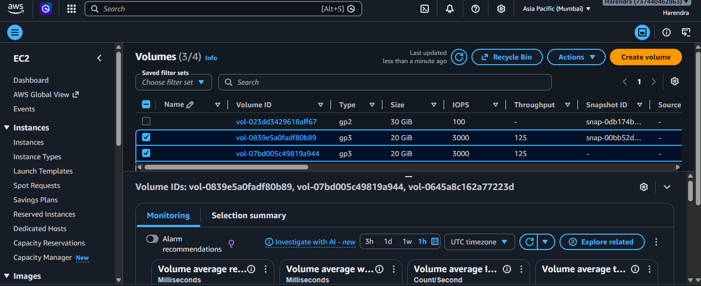
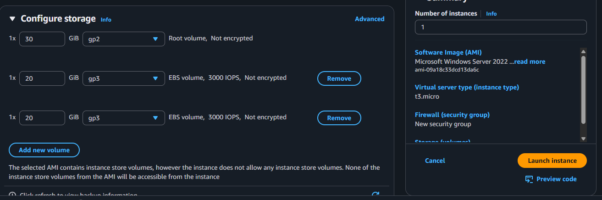
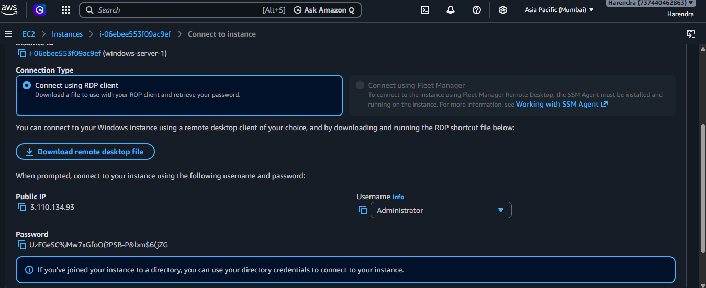
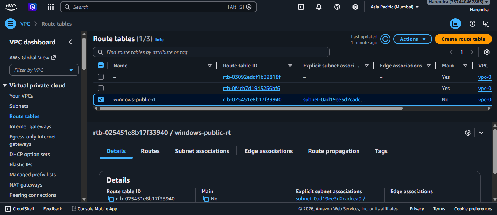
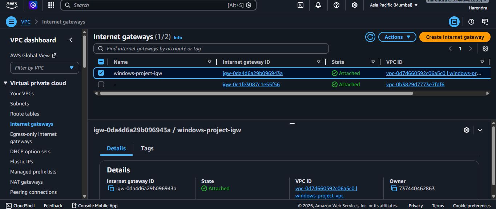
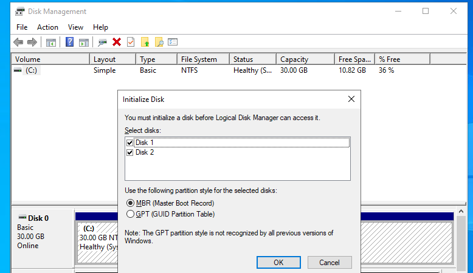
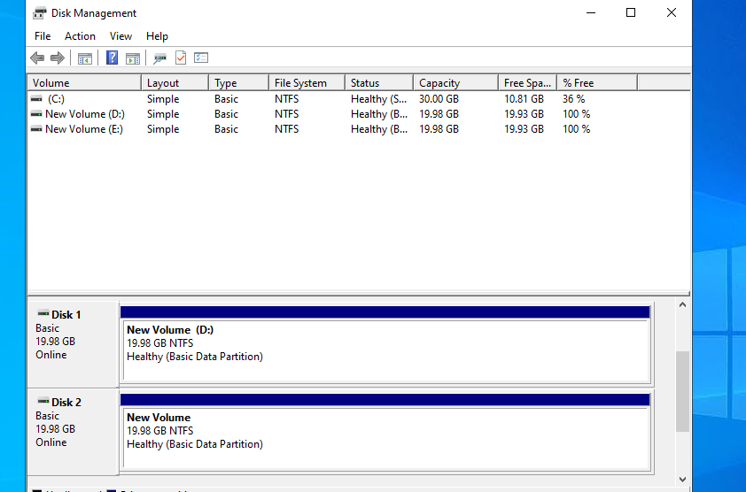
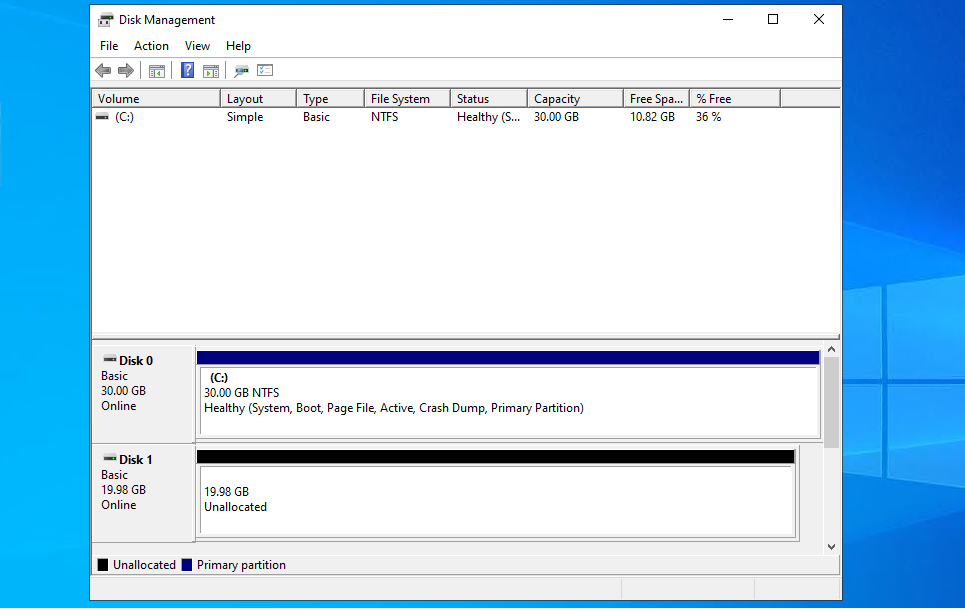
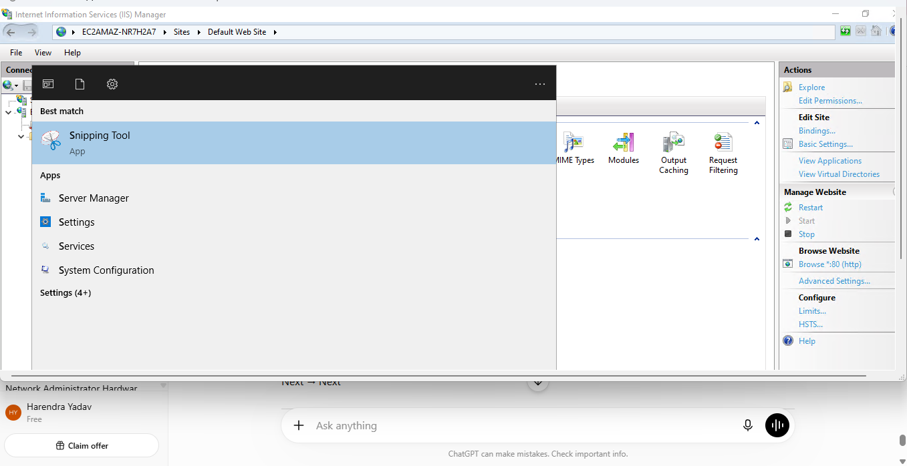
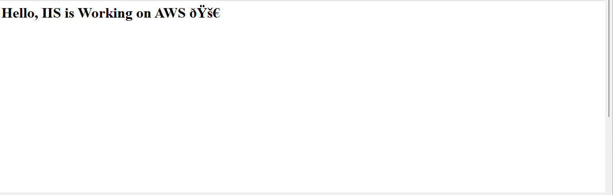

# aws-windows-server-raid-iis-project
Hands-on AWS project demonstrating Windows Server deployment, EBS RAID 1 setup, and IIS website hosting.
# AWS EC2 Windows Server with RAID 1 and IIS Hosting

## Project Overview

This project demonstrates how to deploy a Windows Server on AWS EC2, configure RAID 1 for data redundancy, and host a website using IIS.

---

## Services Used

* AWS EC2
* Amazon EBS
* Windows Server 2022
* IIS (Internet Information Services)
* RAID 1 (Mirrored Volume)

---

## Architecture

EC2 Windows Server → EBS Volumes → RAID 1 → IIS Web Server → Hosted Website

---

## Step-by-Step Implementation

### Step 1: Launch Windows EC2 Instance

Configured Windows Server instance.

---

### Step 2: Configure Additional Storage

Attached additional EBS volumes.

---

### Step 3: Connect via RDP

Connected to Windows Server using Remote Desktop.

---

### Step 4: Configure Route Table

Configured networking and routing.

---

### Step 5: Attach Internet Gateway

Enabled internet access.

---

### Step 6: Initialize RAID Disks

Prepared disks for RAID setup.

---

### Step 7: Configure RAID 1

Created mirrored volume.

---

### Step 8: Test RAID Failure

Validated failover.

---

### Step 9: Install IIS

Installed and configured IIS.

---

### Step 10: Host Website

Deployed sample HTML page.

---

## Learning Outcomes

* Windows Server deployment on AWS
* EBS volume attachment
* RAID 1 configuration
* Disk redundancy testing
* IIS installation and hosting
* Basic AWS networking

---

## Final Result

Successfully deployed a Windows Server on AWS with RAID 1 storage and hosted a working IIS website.
